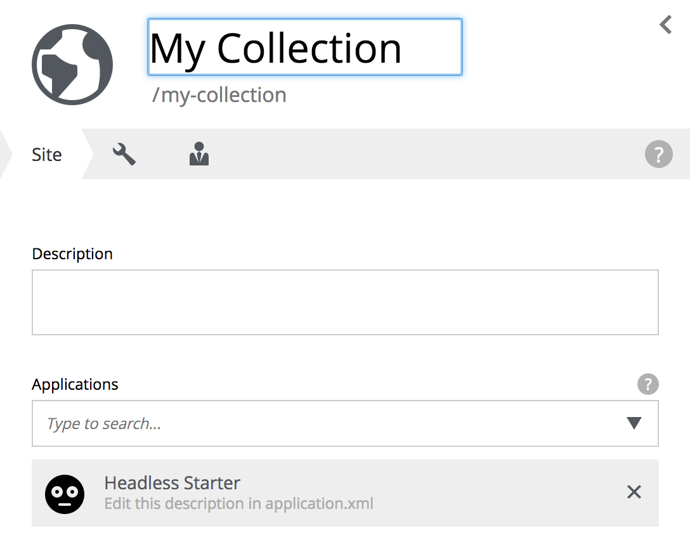

= Headless CMS Starter: Building a Headless Movie Database
:toc: right
:experimental:

*This is a step-by-step tutorial for using Enonic XP as back-end to create and serve content for any client*

== Introduction

Editorial content is now being consumed and served by an increasing number of channels and devices, far beyond the traditional websites.
Combined with the popularity of cloud and micro-service architectures, a new breed of Content Management Systems has emerged - popularly called "Headless CMS".

Running Enonic XP in headless mode simply means using XP to create and manage content, while serving the raw data through an API - rather than dealing with presentation and rendering directly.

During this tutorial you will learn:

* How to initialize a new project based on the "Headless Starter Kit"
* How to access and use "Content Studio" for accessing and editing content
* How to create your own content types from scratch
* How to access and use the API
* How to deploy to production

****
[CAUTION]
====
In order to complete this tutorial, you first need to install *version 6.15* or newer of the https://developer.enonic.com/guides/install-developer-environment[Enonic Developer environment].
====
****

== Initializing a new project

Let's start by initializing our project. We will use the Headless CMS starter kit as a template for our project:

[cols="1%s,99%a"]
[frame="none"]
[grid="none"]
|============================
|1| *Visit* https://market.enonic.com/vendors/enonic/headless-cms-starter[Headless Starter kit on Enonic Market].
|2| *Click btn:[Clone]*
|3| *Initialize project:* Follow the instructions to execute init-project command and specify the name of your app. We will use `com.enonic.starter.headless` throughout this tutorial.
|4| *Verify project files:* The initialization command will now have generated a project file structure on your local machine. From now, we will refer to the location of your project files as $PROJECT_HOME. The most important files and folders for this tutorial are listed below

[source,files]
----
src/
 main/
  resources/
   import <1>
   site/ <2>
    content-types/ <3>
    x-data/ <4>
sample/ <5>
----

<1> Sample content for Headless Movie Database
<2> This is where CMS-specific functionality is placed
<3> Content Types are placed in this directory
<4> X-data enables editors to add additional fields to content across different content types
<5> Sample files that will be used in the tutorial
|============================

NOTE: For more details, watch this https://www.youtube.com/watch?v=Fpudgai1Fsk[video on how to initialize projects].

== Building and Deploying

Now that we have a project, its time to build and deploy the app to the development environment.

[cols="1%s,99%a"]
[frame="none"]
[grid="none"]
|============================
|1| *Change directory* to your newly created project folder
|2| *Run the build script*.

  ./gradlew build

|3| *Deploy the app*.

As a result of the build command, a deployment file will be created in the folder `$PROJECT_HOME/build/libs/` with a name related to your project i.e. "headless.jar"'.
Deploy the file by copying it into $XP_HOME/deploy/, where $XP_HOME is the home directory of your local XP installation.

NOTE: A faster way to build and deploy is by simply running  the command `./gradlew deploy` (Linux/MacOS) or `gradlew.bat deploy` (Windows). For this command to work, you must have configured the system variable XP_HOME to match your XP installation.

|4| *Verify that the app is installed:* From the log of your local XP server, you should see something like this:

  2018-08-02 13:40:40,765 INFO  c.e.x.c.i.app.ApplicationServiceImpl - Application [com.enonic.starter.headless] installed successfully

You may also see more details from the Admin Console/Applications interface:

image::images/app.png["Application Details", width="1096px"]

|============================

== Headless Movie Database

Your app now includes both sample content types and an accompanying dataset we call the "Headless Movie Database".
When the app was deployed, it automatically created a site with the *HMDB* dataset in XP.

To see the content, we need to open the CMS authoring interface called "Content Studio".

[cols="1%s,99%a"]
[frame="none"]
[grid="none"]
|============================
|1| *Log in to the Admin Console:* Typically available on http://localhost:8080/
|2| *Select "Content Studio"* from the menu:
You should now be able to browse, and edit the *HMDB* content:

image::images/hmdb.png["Headless Movie Database", width="1022px"]

|============================

The *HMDB* is built from three different content types: *Person*, *Playlist* and *Movie*.
Each content type defines a specific form that editors can use to edit and publish new items.

TIP: For more information. Check out the http://docs.enonic.com/en/stable/admin/contentstudio/index.html[Content Studio documentation]

=== Person Content Type

Let's have a closer look at the content type "Person".
When creating or editing a Person content, this is what the form looks like in the Content Studio App:

image::images/person.png["Person Form", width="728px"]

The form is generated based on the file `/src/main/resources/site/content-type/person/person.xml` from the project structure:

[source,XML]
----
include::../src/main/resources/site/content-types/person/person.xml[]
----

=== eXtra Data

The form also has an additional step for "Social Media" as can be seen below:

image::images/some.png["Social Media form step", width="737px"]

This step is loaded from a so-called eXtra data file (x-data for short).
The benefit of x-data is that it can be re-used across different content types (even across different apps within the same site).
For this X-data specifically, we can see it is restricted to use only for the "Person" and "Movie" content types.

[source,XML]
----
include::../src/main/resources/site/x-data/SoMe/SoMe.xml[]
----

Read more about X-data from the https://docs.enonic.com/en/stable/developer/schema/x-data.html[documentation].

== Adding a custom content type

To make things even more interesting, lets extend the project with a new content type for reviews.

[cols="1%s,99%a"]
[frame="none"]
[grid="none"]
|============================
|1| *Move the file* `sample/review/review.xml` to `src/main/resources/site/content-types/review/review.xml` in your project.
|2| *Optionally add icon* by moving the file `sample/review/review.svg` to `src/main/resources/site/content-types/review/review.svg` to get a nice icon in Content Studio.
|3| *Build and deploy* your application once more.
|4| *Write A review*. You should now be able to create a "Review" within Content Studio and the *HMDB* site.

image::images/review.png["Sample Review", width="687px"]
|============================

TIP: There is more to learn from the http://docs.enonic.com/en/stable/developer/schema/index.html[Content Types documentation]

== Accessing HMDB through the API

The headless starter uses the the https://market.enonic.com/vendor/enonic/guillotine[Project Guillotine],
to automatically generate a powerful GraphQL API based on available content within a site.

The easiest way to test the API is by installing https://market.enonic.com/vendors/enonic/graphiql[GraphiQL] from Enonic Market.

[cols="1%s,99%a"]
[frame="none"]
[grid="none"]
|============================
|1| *Log into the Admin Console*
|2| *Click "Applications"* in the launcher menu
|3| *Click btn:[Install]* find and install the app "GraphiQL"
|4| *Launch GraphiQL* from the launcher menu
|5| *Add the API URL* to GraphiQL

You can use the following url http://localhost:8080/portal/draft/hmdb/_/service/com.enonic.starter.headless/graphql

NOTE: If you used a different name for your app, make sure to replace `com.enonic.starter.headless` with yours.
|============================

NOTE: *New to GraphQL?* If you are not familiar with GraphQL, we recommend checking out the https://graphql.org[GraphQL documentation after completing this tutorial.

When GraphiQL has successfully connected to the service, you will automatically be able to access the API documentation from the right hand side.
Queries can now be typed into the left hand panel and executed.
The result will be listed in the center panel.

Below are a few examples of queries we can use to access the *HMDB*.

NOTE: When accessing your customized content types and content, the API is essentially the same, but you must adapt the queries to match with your model.

=== Fetching Persons

The query below will fetch the Display Name of five items from the "persons/" folder:
[source,GraphQL]
----
{
 guillotine {
  getChildren(key:"/hmdb/persons" first:5){
    displayName
    _path
  	}
	}
}
----

Sample response from the API:
[source,JSON]
----
{
  "data": {
    "guillotine": {
      "getChildren": [
        {
          "displayName": "Brad Pitt",
          "_path": "/hmdb/persons/brad-pitt"
        },
        {
          "displayName": "Keanu Reeves ",
          "_path": "/hmdb/persons/keanu-reeves"
        },
        {
          "displayName": "Carrie-Anne Moss ",
          "_path": "/hmdb/persons/carrie-anne-moss"
        },
        {
          "displayName": "The Wachowskis",
          "_path": "/hmdb/persons/the-wachowskis"
        },
        {
          "displayName": "Bruce Willis",
          "_path": "/hmdb/persons/bruce-willis"
        }
      ]
    }
  }
}
----

=== Fetching movies and cast

The query below will fetch the Display Name, and the cast of two movies:
[source,GraphQL]
----
{
  guillotine {
    query(query: "type='com.enonic.starter.headless:movie'", first: 2) {
      displayName
      ... on com_enonic_starter_headless_Movie {
        data {
          cast {
            actor {
              displayName
            }
            character
          }
        }
      }
    }
  }
}
----

Sample response from the API:
[source,JSON]
----
{
  "data": {
    "guillotine": {
      "query": [
        {
          "displayName": "The Godfather",
          "data": {
            "cast": [
              {
                "actor": {
                  "displayName": "Al Pacino"
                },
                "character": " Michael Corleone"
              }
            ]
          }
        },
        {
          "displayName": "The Shawshank Redemption",
          "data": {
            "cast": [
              {
                "actor": {
                  "displayName": "Tim Robbins"
                },
                "character": "Andy Dufresne"
              },
              {
                "actor": {
                  "displayName": "Morgan Freeman"
                },
                "character": "Ellis Boyd 'Red' Redding"
              },
              {
                "actor": {
                  "displayName": "Bob Gunton"
                },
                "character": "Warden Norton"
              }
            ]
          }
        }
      ]
    }
  }
}
----

=== Fetching Actors and their photo

The query below will return the name of the actor and a link to a 400x400 scaled photo:
[source,GraphQL]
----
{
  guillotine {
    query(query: "ngram('_allText', 'morgan') AND type='com.enonic.starter.headless:person'", first: 6) {
      displayName
      ... on com_enonic_starter_headless_Person {
    	  displayName
        data {
          photos(first:1){
            ... on media_Image {
              imageUrl(type:absolute scale:"block(400,400)")
            }

          }
        }
      }
    }
  }
}
----

Sample response from the API:
[source,JSON]
----
{
  "data": {
    "guillotine": {
      "query": [
        {
          "displayName": "Morgan Freeman",
          "data": {
            "photos": [
              {
                "imageUrl": "http://localhost:8080/portal/draft/hmdb/_/image/7ab1f76a-69a1-490f-b505-6eb6773c7cec:603726cc4fa712aa1b70c7eb64e1349f664494c3/block-400-400/morgan-freeman.jpg"
              }
            ]
          }
        }
      ]
    }
  }
}
----

When deployed to production, the image url will be aligned with the production domain.

== Creating your own site from scratch

So far, we have used the standard site and content that was imported from *HMDB*. If you want to setup your own collection of content, we can easily use Content Studio to build other sites as well.

To create your own site:

[cols="1%s,99%a"]
[frame="none"]
[grid="none"]
|============================
|1| *Click btn:[New]* at a desired location in the structure, and choose the content type "Site".
|2| *Add your application to the site*

|3| You may now start creating content within the new site
|============================

TIP: You are completely free to group your content in folders and tree-structures, as well as setting permissions as you desire within the site, just like we do with *HMDB*.

== Deploying to Production

To deploy your application to production, your first need a server running Enonic XP.
If you don't already have a server, we recommend trying out https://developer.enonic.com/guides/deploying-to-google-cloud[Google Cloud],
or request an instance from the https://enonic.com[Enonic Cloud].

NOTE: Enonic XP is both open source, and can run on any infrastructure and in any cloud, in contrast to other popular Headless CMS offerings.

Read more about https://docs.enonic.com/en/stable/operations/index.html[production deployment of Enonic XP] in the documentation.

== Removing HMDB from your project

Clean up your project by removing HMDB content, the schemas, _this_ documentation and the samples files from your cloned project.

Remove the following files and folders:

* src/main/java* (Java code used to import the HMDB data)
* src/main/resources/import* (the HMDB dataset)
* src/main/resources/site/content-types/* (HMDB content types)
* src/main/resources/site/x-data/* (X-data form)
* docs/* (Contains the documentation you are reading - can be build using `gradle asciidoctor`)
* sample* (Sample config files)
