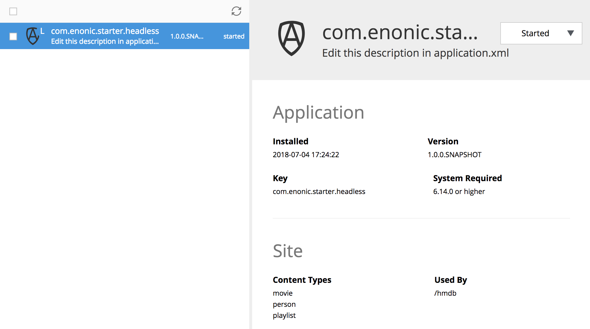
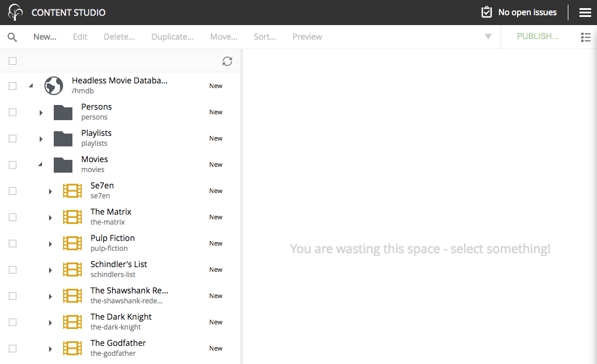
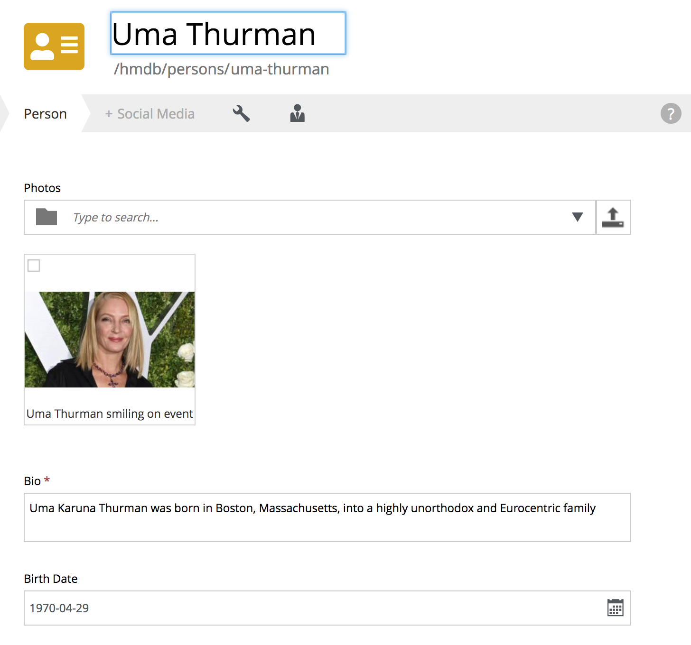
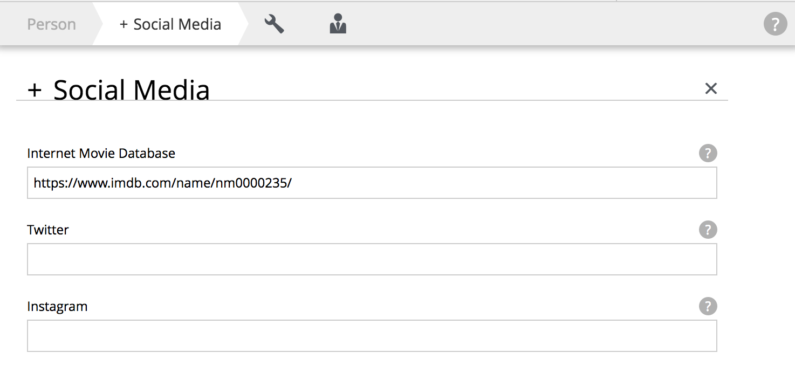
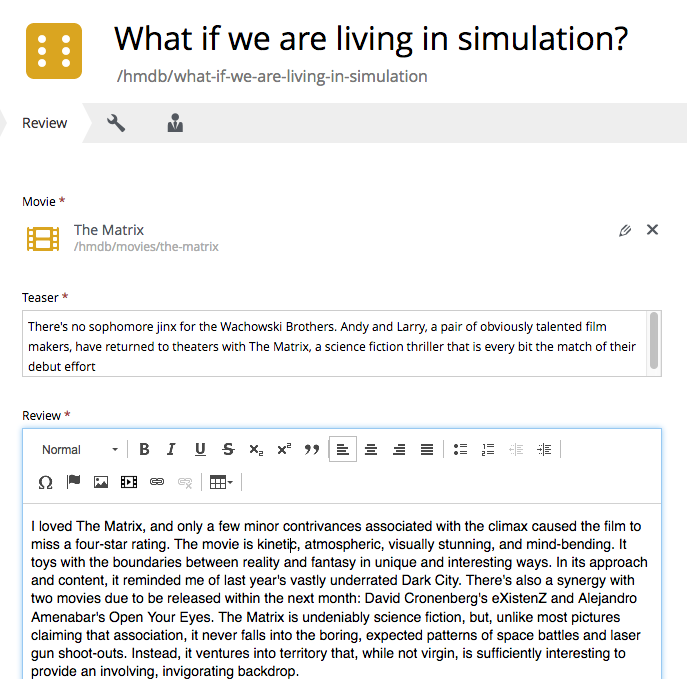

= Get started with Headless CMS

*A step-by-step tutorial for building your first headless content back-end with Enonic XP*

== Introduction

During this tutorial you will learn:

* How to initialize a new project based on the Headless Starter
* About the sample project included in the starter: "Headless Movie Database"
* How to create your own content types from scratch
* How to access and use the Headless API
* Some useful tips and tricks for Headless projects

== Setting up your project

****
[CAUTION]
====
In order to complete this tutorial, you first need to install the https://developer.enonic.com/enonic-101/install-developer-environment[Enonic Developer environment]
====
****

Let's start by initializing a project:

. *Go to the Headless Starter kit* on https://market.enonic.com/vendors/enonic/headless-starter[Enonic Market]
. *Click the* btn:clone
. *Follow the instructions* by running the init-project command and specify the name of your app. We will `com.enonic.starter.headless` throughout the tutorial.
. *Verify the project files*. The command will now have generated a project file structure on your local machine. The most important files and folders for this tutorial are:

[source,files]
----
src/
 main/
  resources/
   site/ <1>
    content-types/ <2>
    x-data/ <3>
----

<1> This is where CMS-specific functionality is placed
<2> Content Types are placed in this directory
<3> X-data enables editors to add additional fields to content across different content types

NOTE: Optionally watch this https://www.youtube.com/watch?v=Fpudgai1Fsk[video about initializing projects].

== Building and Deploying

Now that we have a project, its time to build and deploy the app to the development environment.

. *Change directory* to your newly created project folder
. *Run the build script*. The app file will be placed in the build/libs/ folder.

  ./gradlew build

. *Deploy the app*.

  ./gradlew deploy

. *Verify* that the app is installed and started from the Applications tool.

NOTE: For the deploy command to work, you must have configured system variable XP_HOME. Alternatively, simply upload the build file located in the build/libs/ directory of your project.

== Headless Movie Database

Your app includes both sample content types and an accompanying dataset we call the "Headless Movie Database".
When the app was deployed, it automatically created a site with the *HMDB* dataset in Content Studio.

To access the data, simply login to your Admin Console and access Content Studio:

NOTE: To remove *HMDB* from your project see: <<Removing HMDB>>

The *HMDB* contains three content types, which we will use throughout this tutorial: *Person*, *Playlist* and *Movie*.
Each content type defines a specific form editors can use to easily add and manage content.

=== Person Content Type

Let's have a closer look at the content type "Person".
When creating or editing a Person content, this is what the form looks like in the Content Studio App:

The form is generated based on the file `/src/main/resources/site/content-type/person/person.xml` from the project structure:

[source,XML]
----
include::../src/main/resources/site/content-types/person/person.xml[]
----

=== eXtra Data

The form also has an additional step for "Social Media" as can be seen below:

This step is loaded from a so-called eXtra data file (x-data for short).
The benefit of x-data is that it can be re-used across different content types (even across different apps within the same site).
For this X-data specifically, we can see it is restricted to use only for the "Person" and "Movie" content types.

[source,XML]
----
include::../src/main/resources/site/x-data/SoMe/SoMe.xml[]
----

Learn more about using X-data TODO

== Adding a custom content type

To make things even more interesting, lets extend the project with a new content type for reviews.

. *Move the file* `sample/review/review.xml` to `src/main/resources/site/content-types/review/review.xml` in your project.
. *Optionally add icon* by moving the file `sample/review/review.svg` to `src/main/resources/site/content-types/review/review.svg` to get a nice icon in Content Studio.
. *Build and deploy* your application once more. NB! The deploy command will both build and deploy the app

  ./gradlew deploy

. *Write A review*. You should now be able to create a "Review" within Content Studio and the *HMDB* site.:
+

+

If you want to learn more about schemas and building content types in Enonic XP, check out the http://docs.enonic.com/en/stable/developer/schema/index.html[full documentation]

== Accessing HMDB through the API

The headless starter uses the the https://market.enonic.com/vendor/enonic/guillotine[Guillotine project],
to automatically generate a powerful GraphQL API based on available content types in the site.

If you are not familiar with GraphQL, we recommend checking out the https://graphql.org[GraphQL documentation after] completing this tutorial:

The Easiest way to access the API is by installing https://market.enonic.com/vendors/enonic/graphiql[GraphiQL] from Enonic Market.

. From the Admin Console, select "Applications" from the launcher menu
. Click btn:install
. Search for and install GraphiQL
. You may now open GraphiQL from the launcher menu

Once loaded, GraphiQL will attempt to find the endpoint for your API and load it.

****
[NOTE]
====
If GraphiQL does not find your API, try pasting in the following url:
http://localhost:8080/portal/draft/hmdb/_/service/<name of your app>/graphql

Make sure to replace "<name of your app>" in the url.
====
****

After GraphiQL is correctly deployed, you will automatically be able to access the documentation of the API from the right hand side.

Below we will give a few examples of how to use the API

=== Fetching persons

The query below will fetch the Display Name of five items from the "persons/" folder:
[source,GraphQL]
----
{
 guillotine {
  getChildren(key:"/hmdb/persons" first:5){
    displayName
    _path
  	}
	}
}
----

Sample response from the API:
[source,JSON]
----
{
  "data": {
    "guillotine": {
      "getChildren": [
        {
          "displayName": "Brad Pitt",
          "_path": "/hmdb/persons/brad-pitt"
        },
        {
          "displayName": "Keanu Reeves ",
          "_path": "/hmdb/persons/keanu-reeves"
        },
        {
          "displayName": "Carrie-Anne Moss ",
          "_path": "/hmdb/persons/carrie-anne-moss"
        },
        {
          "displayName": "The Wachowskis",
          "_path": "/hmdb/persons/the-wachowskis"
        },
        {
          "displayName": "Bruce Willis",
          "_path": "/hmdb/persons/bruce-willis"
        }
      ]
    }
  }
}
----

=== Fetching movies and cast

The query below will fetch the Display Name, and the cast of two movies:
[source,GraphQL]
----
{
  guillotine {
    query(query: "type='com.enonic.starter.headless:movie'", first: 2) {
      displayName
      ... on com_enonic_starter_headless_Movie {
        data {
          cast {
            actor {
              displayName
            }
            character
          }
        }
      }
    }
  }
}
----

Sample response from the API:
[source,JSON]
----
{
  "data": {
    "guillotine": {
      "query": [
        {
          "displayName": "The Godfather",
          "data": {
            "cast": [
              {
                "actor": {
                  "displayName": "Al Pacino"
                },
                "character": " Michael Corleone"
              }
            ]
          }
        },
        {
          "displayName": "The Shawshank Redemption",
          "data": {
            "cast": [
              {
                "actor": {
                  "displayName": "Tim Robbins"
                },
                "character": "Andy Dufresne"
              },
              {
                "actor": {
                  "displayName": "Morgan Freeman"
                },
                "character": "Ellis Boyd 'Red' Redding"
              },
              {
                "actor": {
                  "displayName": "Bob Gunton"
                },
                "character": "Warden Norton"
              }
            ]
          }
        }
      ]
    }
  }
}
----

=== Fetching Actors and their photo

The query below will return the name of the actor and a link to a 400x400 scaled photo:
[source,GraphQL]
----
{
  guillotine {
    query(query: "ngram('_allText', 'morgan') AND type='com.enonic.starter.headless:person'", first: 6) {
      displayName
      ... on com_enonic_starter_headless_Person {
    	  displayName
        data {
          photos(first:1){
            ... on media_Image {
              imageUrl(type:absolute scale:"block(400,400)")
            }

          }
        }
      }
    }
  }
}
----

Sample response from the API:
[source,JSON]
----
{
  "data": {
    "guillotine": {
      "query": [
        {
          "displayName": "Morgan Freeman",
          "data": {
            "photos": [
              {
                "imageUrl": "http://localhost:8080/portal/draft/hmdb/_/image/7ab1f76a-69a1-490f-b505-6eb6773c7cec:603726cc4fa712aa1b70c7eb64e1349f664494c3/block-400-400/morgan-freeman.jpg"
              }
            ]
          }
        }
      ]
    }
  }
}
----

When deployed to production, the image url will be aligned with the production domain.

=== GraphQL Clients

The headless API can be accessed from virtually any programming language or device.
We recommend checking out the Apollo project!

== Creating your own site from scratch

Content Studio lets you create "collections" of content based on your app, we call these sites.
You may even create multiple sites from a single application.

To create your own site:

. Select the location where you want to place the site
. Click btn:new and choose "Site" from the list of content types.
. Add your application (and even others) to the site
. You may now start creating content within the new site

image::images/hello.png["Output from main.js controller"]

TIP: You are free to group your content in folders and tree-structures as desired within a site, like we do in the HMDB.

== Deploying to Production

To deploy your application to production, your first need a server running Enonic XP.
If you don't already have a server, we recommend trying out https://developer.enonic.com/guides/deploying-to-google-cloud[Google Cloud],
or request an instance from the https://enonic.com[Enonic Cloud].

NOTE: Enonic XP is both open source, and can run on any infrastructure and in any cloud, in contrast to other popular Headless CMS offerings.

Read more about https://docs.enonic.com/[production deployment of Enonic XP].

== Removing HMDB

To completely remove HMDB from your new project, simply remove the following files and folders after initializing:

* src/main/resources/java* (used to import the HMDB data)
* src/main/resources/import* (the HMDB dataset)
* src/main/resources/site/content-types/* (Misc content types)
* src/main/resources/site/x-data/* (X-data form)
